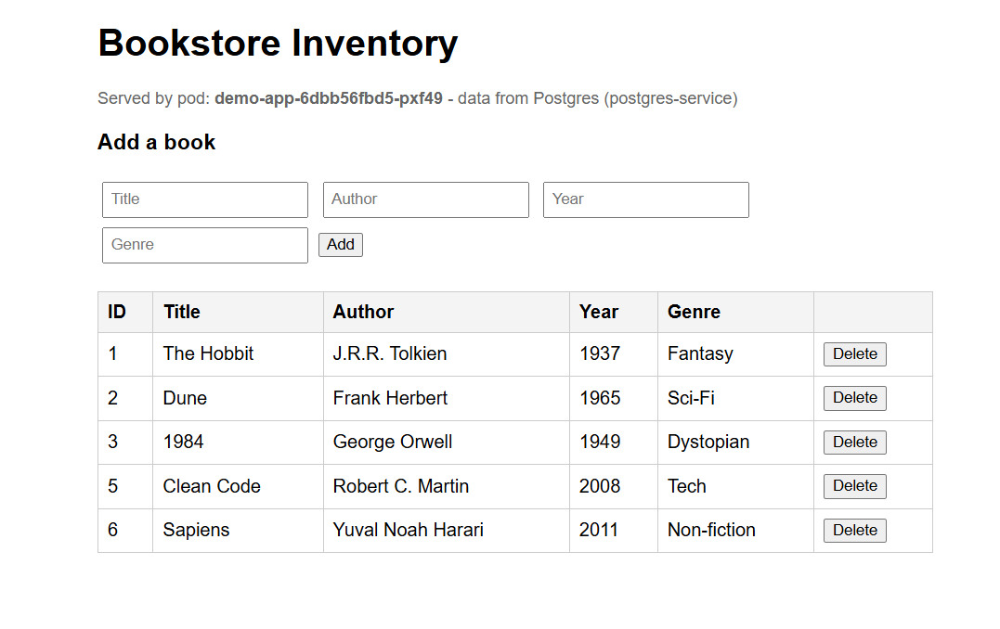

# Deploying to EC2 (k3s + Docker Hub)

This runs the same app end-to-end, but on a real cloud VM instead of a local cluster.
Two things differ from local minikube: (1) images come from a registry (Docker Hub)
instead of being loaded directly, and (2) ingress uses k3s's built-in Traefik.

## 1. Launch the EC2 instance
- AMI: Ubuntu 22.04 or 24.04 LTS
- Instance type: **t3.medium** minimum (2 vCPU / 4GB RAM) — k3s + Postgres + app need headroom
- Storage: 20GB gp3 is plenty
- Key pair: your SSH key

### Security Group — inbound rules
| Type       | Port | Source          | Why                        |
|------------|------|-----------------|-----------------------------|
| SSH        | 22   | Your IP only    | Admin access                |
| HTTP       | 80   | 0.0.0.0/0       | Reach the app via Ingress   |
| Custom TCP | 6443 | Your IP only    | (optional) remote kubectl   |

Do **not** open Postgres's port 5432 to the internet — it stays ClusterIP-only inside the cluster.

## 2. SSH in and bootstrap
```bash
scp ec2-setup.sh ubuntu@<EC2_PUBLIC_IP>:~
ssh -i your-key.pem ubuntu@<EC2_PUBLIC_IP>
bash ec2-setup.sh
# log out and back in so the docker group membership applies
exit
ssh -i your-key.pem ubuntu@<EC2_PUBLIC_IP>
k3s kubectl get nodes      # should show Ready
```

## 3. Build and push the app image to Docker Hub
You can do this **on the EC2 box itself** (simplest — no need to move files around):
```bash
# copy your project files to EC2 first, e.g.:
scp -r books-demo ubuntu@<EC2_PUBLIC_IP>:~
ssh ubuntu@<EC2_PUBLIC_IP>
cd books-demo

docker login
docker build -t YOUR_DOCKERHUB_USERNAME/demo-app:v1 .
docker push YOUR_DOCKERHUB_USERNAME/demo-app:v1
```

Then update the image reference in `deployment.yaml`:
```bash
sed -i 's|YOUR_DOCKERHUB_USERNAME/demo-app:v1|<your actual dockerhub-username>/demo-app:v1|' deployment.yaml
```

## 4. Deploy the database
```bash
sudo kubectl apply -f secret.yaml
sudo kubectl apply -f postgres-pvc.yaml
sudo kubectl apply -f postgres-deployment.yaml
sudo kubectl apply -f postgres-service.yaml
sudo kubectl get pods -l app=postgres --watch
```
(k3s's default local-path-provisioner satisfies the PVC automatically — no extra setup.)

## 5. Deploy the app
```bash
sudo kubectl apply -f deployment.yaml
sudo kubectl apply -f service.yaml
sudo kubectl apply -f ingress-ec2.yaml     # NOTE: use this file, not ingress.yaml, on k3s
sudo kubectl get pods -l app=demo-app --watch
```

## 6. Watch it live in the browser
No tunneling needed this time — it's a real public IP:
```
http://<EC2_PUBLIC_IP>
```
Just open that directly in your browser.

## 7. Verify + interact
```bash
sudo kubectl logs -l app=demo-app -c wait-for-postgres
sudo kubectl logs -l app=demo-app -c demo-app        # should show "Seeded 6 books."
sudo kubectl exec -it deploy/postgres -- psql -U postgres -d bookstore -c "SELECT * FROM books;"
```

## 8. Updating the app later
```bash
docker build -t YOUR_DOCKERHUB_USERNAME/demo-app:v2 .
docker push YOUR_DOCKERHUB_USERNAME/demo-app:v2
kubectl set image deployment/demo-app demo-app=YOUR_DOCKERHUB_USERNAME/demo-app:v2
kubectl rollout status deployment/demo-app
```

## Cost / cleanup note
A t3.medium running 24/7 costs money. When you're done experimenting:
```bash

# from your own machine, not the instance
aws ec2 terminate-instances --instance-ids <your-instance-id>
```
Or simply stop the instance from the EC2 console if you want to keep it for later
(you'll still be billed for the EBS volume while stopped, just not compute).

## What's different from a "toy" setup here
- Images go through a real registry (Docker Hub) — the same pattern used in production,
  just without a private registry or CI pipeline in front of it.
- Traffic hits a real public IP over a Security Group, not a local tunnel.
- Data persists via k3s's local-path-provisioner-backed PVC — survives pod restarts,
  though it is tied to this one EC2 instance's disk (not yet resilient to instance loss;
  that's what EBS-backed StorageClasses / RDS would solve in a "real" production setup).

